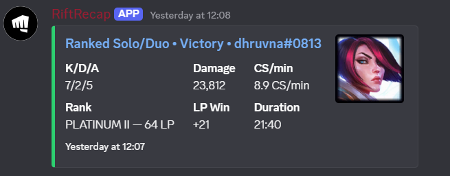
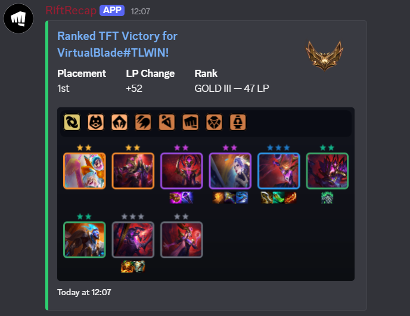

# Rift Recap History

This document archives the early project timeline and legacy TODO/backlog notes that were previously kept in `README.md`.

## Legacy TODOs / backlog snapshot
- Optional per-game channel routing/filter presets (finer TFT vs LoL control)
- LOOK INTO RESETRANKS IN MORE DEPTH*
- Host bot 24/7
- Patch notes / release changelog
- `/lastmatch` command
- Optional match history browsing
- sometimes matches post twice?

---

## Progress timeline

**Day 1: 1/22/2026**
- Discord bot created
- Riot API key refreshed daily for temporary use
- Basic node.js structure created
- Basic ping command created (/ping)
- Can fetch TFT Ranked profile summary (/rank)
- All commands need to be run manually, goal is to try automatic implementation soon

**Day 2: 1/23/2026**
- Deciding on format of Discord embeds
- {Ranked/Double Up} {Victory/Defeat} for {gameName#tagLine}
- **Placement |   Rank   | {Win/Loss}**                        IMAGE?
-   1st-8th   |  D4 2LP  |  +- X LP
- Now stores registered users, need to update rank command to reflect this next
- Creates file if it didn't exist, updates atomically
- Changed platform/routing to just default to NA and to have a dropdown menu to reduce user error
Live Match Tracking
- Use league of graphs to embed the link for the match after it is finished
- Data dragon can embed some image, maybe their little legend?

**Day 3: 1/24/2026**
- Rank command now supports dropdown, no more manual input
- Fixed issue with only one embed sending when user has ranked + double up to show
- League of graphs link shows on rank command
- Added an unregister command
- After a game, embed is sent in discord with a link to the LeagueOfGraphs page. WIP
- Keeping snapshots of last LP, last game id, etc to make this possible

**Day 4: 1/25/2026**
- Fixed link structure for post game tracking
- Better updating json to track lp snapshots without error
- Plenty of redundant code is currently present at EOD, but functionality works. Next up, we trim the fat
- Operation works but is unstable

**Day 5: 1/26/2026**
- Match tracking fully functional and stable
- Improved match result embed design (Victory / Defeat cards)
- Fixed LP snapshot overwrites and async embed bugs
- Refactored polling to safely persist rank and match state
- System now stable enough for feature iteration and cleanup

**1/27/2026 - 2/6/2026**
- Recap columns only show either wins or losses, win column no longer shows negatives / zeros
- Update account info with rich information (include W/L/etc EVERYTIME)
- Autopost recap every morning at 9AM 
- Added command to config recap `/recapconfig`
- Added LP standardization so that division changes are handled properly (IRON: 0, PLATINUM: 1600, MASTERS: 2800+)
- Various bug fixes

**2/7/2026 - Present**
- Haven't updated history frequently, but current version supports TFT + LoL
- Rebranded to RiftRecap
S

S

